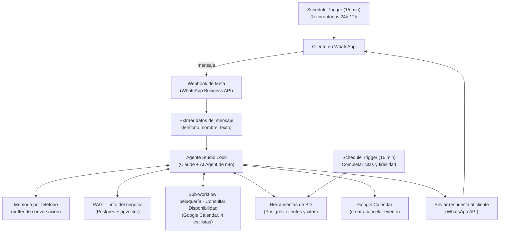

# Studio Look — Agente de WhatsApp con IA para peluquerías

Agente conversacional por WhatsApp para **Studio Look**, una peluquería/salón de belleza unisex en Ibagué, Colombia, construido en **n8n** con un modelo de **Claude (Anthropic)** como cerebro. Atiende clientes, cotiza servicios, agenda y cancela citas en **Google Calendar**, lleva un **sistema de fidelidad** (servicio gratis cada 6 visitas) y envía **recordatorios automáticos** de 24h y 2h antes de cada cita.

Este proyecto reutiliza la arquitectura ya probada en el proyecto hermano **[Mostacho Barbería](../mostacho-barberia)**, adaptada al sector de peluquerías/salones de belleza: distinto esquema de servicios (incluye tinte, manicure, pedicure, tratamiento capilar), distinto equipo (estilistas en vez de barberos) y su propio esquema de base de datos.

> "Studio Look" es el nombre comercial usado para el demo de portafolio; el negocio de referencia real para precios y servicios es una peluquería unisex de Ibagué.

## El negocio

| | |
|---|---|
| Nombre | Studio Look |
| Ciudad | Ibagué, Tolima, Colombia |
| Dirección | Carrera 5 #20-45 |
| Canal de atención | WhatsApp |
| Horario | Lunes a sábado, 9:00 a.m. – 7:00 p.m. (domingos cerrado) |
| Equipo | Valentina, Camilo, Andrea, Kevin |

### Servicios

| Servicio | Duración aprox. | Precio |
|---|---|---|
| Corte de cabello | 40 min | $25.000 |
| Corte + Barba | 60 min | consultar tarifa vigente |
| Tinte / Color | 120 min | consultar tarifa vigente |
| Manicure | 40 min | consultar tarifa vigente |
| Pedicure | 45 min | consultar tarifa vigente |
| Tratamiento capilar | 90 min | consultar tarifa vigente |

> Ajusta los precios de referencia a la tarifa vigente real de tu salón antes de operar en producción — el agente nunca debe inventar un precio que no esté en su base de conocimiento.

## Qué hace el agente

- **Conversa por WhatsApp** en lenguaje natural, con memoria por número de teléfono.
- **Responde con información real del negocio** (horario, precios, servicios) usando RAG — nunca inventa datos.
- **Agenda citas**: consulta disponibilidad real contra Google Calendar entre los 4 estilistas, ofrece horarios y, si hay un estilista preferido, respeta esa preferencia o propone alternativas cercanas.
- **Cancela o reprograma citas** a pedido del cliente.
- **Registra clientes y citas en una base de datos real** (Postgres), no solo en el calendario.
- **Aplica el programa de fidelidad**: servicio gratis automático cada 6 visitas completadas.
- **Envía recordatorios automáticos** 24 horas y 2 horas antes de cada cita.
- **Marca las citas como completadas automáticamente** y actualiza la fidelidad, sin intervención humana.

## Arquitectura



### Stack técnico

- **n8n** (self-hosted, EasyPanel) — orquestación de todo el flujo
- **Claude (Anthropic)** — modelo de lenguaje del AI Agent
- **WhatsApp Business API (Meta)** — canal de entrada y salida de mensajes
- **Google Calendar API** — agenda real por estilista
- **PostgreSQL + pgvector** — base de datos de clientes/citas y almacén vectorial del RAG
- **Google Gemini** — embeddings para el RAG

## Disponibilidad entre 4 estilistas

A diferencia del proyecto de barbería (un solo recurso por turno), aquí el sub-workflow de disponibilidad reparte la demanda entre **4 estilistas** (Valentina, Camilo, Andrea, Kevin):

- Si el cliente pide un estilista específico, se verifica que esté libre en ese horario exacto.
- Si no pide ninguno, se asigna el primero libre.
- Si el horario pedido está fuera de atención (antes de 9:00 a.m., después de 7:00 p.m., o domingo), se informa sin ofrecer alternativas ese día.
- Si no hay estilistas libres a la hora exacta pedida, se calculan hasta 3 horarios alternativos cercanos (en pasos de 30 minutos) donde sí haya alguien disponible — respetando la preferencia de estilista si la hubo.
- Los eventos de Google Calendar identifican al estilista asignado en el propio título del evento (entre paréntesis), que el código de disponibilidad lee para saber quién está ocupado en cada franja.

## Modelo de datos

Dos tablas en Postgres (nombrado con `estilista` en vez de `barbero`, propio de este proyecto):

**`clientes`**

| Columna | Tipo | Notas |
|---|---|---|
| `telefono` | text (PK) | identificador del cliente |
| `nombre` | text | |
| `cedula` | text | opcional |
| `fecha_nacimiento` | date | opcional |
| `membresia_premium` | boolean | activación manual desde mostrador |
| `contador_visitas` | integer | sube solo al completar una cita |
| `servicio_gratis_disponible` | boolean | se activa al llegar a 6 visitas |
| `created_at` / `updated_at` | timestamp | |

**`citas`**

| Columna | Tipo | Notas |
|---|---|---|
| `id` | serial (PK) | |
| `telefono` | text (FK → clientes) | |
| `servicio` | text | |
| `estilista` | text | asignado por el sub-workflow de disponibilidad |
| `hora_inicio` / `hora_fin` | timestamp | |
| `estado` | text | `agendada` / `completada` / `cancelada` |
| `es_gratis` | boolean | si se usó el premio de fidelidad |
| `calendar_event_id` | text | enlaza con el evento real de Google Calendar |
| `recordatorio_24h_enviado` / `recordatorio_2h_enviado` | boolean | evita reenviar recordatorios |
| `created_at` | timestamp | |

Ver los scripts completos en [`sql/`](sql/).

## Herramientas del agente (AI Agent tools)

| Herramienta | Tipo de nodo | Qué hace |
|---|---|---|
| Consultar info del negocio (RAG) | Postgres PGVector Store (Retrieve) | Responde horarios, precios, servicios con datos reales |
| Consultar disponibilidad | Call n8n Workflow Tool | Llama al sub-workflow "peluquería - Consultar Disponibilidad" |
| Crear cita en Calendar | Google Calendar Tool | Crea el evento real una vez el cliente confirma |
| Registrar cliente | Postgres Tool | `INSERT ... ON CONFLICT DO NOTHING` en `clientes` |
| Consultar fidelidad del cliente | Postgres Tool | Lee el contador de visitas y si tiene servicio gratis disponible |
| Registrar cita en BD | Postgres Tool | Inserta la cita ya creada en Calendar dentro de `citas` |
| Buscar cita del cliente (BD) | Postgres Tool | Localiza la cita activa del cliente para cancelar/reprogramar |
| Marcar cita cancelada en BD | Postgres Tool | Actualiza `estado = 'cancelada'` |

El *prompt* completo del agente está en [`docs/prompt-del-agente.md`](docs/prompt-del-agente.md).

## Lecciones propias de este proyecto

Construido reutilizando el agente de Mostacho Barbería como punto de partida, migrar/adaptar entre dos proyectos de n8n distintos (en vez de construir desde cero) trajo su propia clase de bugs, documentados aquí porque se repiten en cualquier clonación de proyectos similares:

1. **Reimportar entre instancias con distinta versión de n8n rompe nodos.** La primera importación de los workflows de Mostacho a Studio Look dejó varios nodos rotos; la solución fue fijar la misma versión exacta de n8n en origen y destino antes de reimportar, evitando que n8n migre/resetee expresiones y mapeos al importar entre versiones distintas.
2. **El número de prueba de WhatsApp se asigna por Business Portfolio, no por App.** Dos apps de Meta distintas pero dentro del mismo Business Portfolio comparten el mismo Phone Number ID / WhatsApp Business Account ID de prueba — para un número de pruebas realmente independiente por proyecto hay que crear la app en un Business Portfolio distinto.
3. **El webhook con "set mock data" no puede distinguir GET de POST.** Esa decisión depende del método HTTP real de la petición entrante, algo que los datos simulados no reproducen — el nodo Webhook siempre enruta al primer output. Para probar la rama POST hay que usar "Listen for test event" y enviar una petición POST real (por ejemplo desde reqbin.com o `curl`).
4. **El cuerpo de una petición POST real no va envuelto en `"body"`.** Ese envoltorio solo aplica a los *datos simulados* (mock data), que sustituyen toda la salida del nodo incluyendo sus metadatos. Envolver un POST real en `"body"` duplica el anidamiento (`$json.body.body.entry` en vez de `$json.body.entry`) y rompe los filtros que vienen después, de forma silenciosa.
5. **Enviar varias pruebas seguidas con "Listen for test event" activo puede acumular datos.** Repetir el envío sin despinear los datos entre pruebas acumula varios items en arreglos como `messages`/`contacts` en vez de reemplazarlos, rompiendo cualquier lógica que solo lea el primer elemento.
6. **Las referencias de las herramientas del AI Agent a sub-workflows no se actualizan solas.** Un nodo "Call a workflow" dentro del Agente guarda su propio puntero a un workflow específico — al duplicar o migrar un proyecto, ese puntero sigue señalando al workflow original (en este caso, al de Mostacho) hasta que se reselecciona manualmente.
7. **Límite de 2 Client Secrets activos por Client ID de Google OAuth2.** Reutilizar el mismo Client ID entre proyectos mientras no está claro cuál secreto quedó pegado en cuál credencial de n8n causa errores de "Unable to sign without access token" / "Client authentication failed" — se resuelve generando un secreto nuevo, verificando que el OTRO proyecto que comparte el Client ID siga funcionando después.
8. **Error de nombre de campo en la Session Key de la memoria del agente.** El campo de sesión usaba `{{ $json.numero_telefono }}`, pero el nodo que extrae los datos del mensaje en realidad produce un campo llamado `telefono` — la discrepancia nunca lanza un error visible, solo hace que el agente "olvide" el contexto entre mensajes. Se corrigió apuntando directo al nodo: `{{ $('Extraer datos del mensaje').item.json.telefono }}-v1`.
9. **Fallo silencioso de escritura en base de datos.** Una consulta de un Postgres Tool con nombres de columna heredados del otro proyecto (`barbero` en vez de `estilista`) puede fallar sin que la conversación de WhatsApp lo muestre — el agente llegó a confirmar una cita y crear el evento real en Calendar mientras el `INSERT` fallaba por completo. Solo se detecta abriendo el nodo manualmente y usando "Execute step". **Lección operativa**: tras clonar un proyecto a otro negocio con un esquema de base de datos distinto, revisar uno por uno todos los nodos que escriben en la base, no solo probar el flujo conversacional de punta a punta.

## Instalación

1. Importa los workflows de [`workflows/`](workflows/) en tu instancia de n8n (misma versión de n8n en origen y destino).
2. Ejecuta los scripts de [`sql/`](sql/) en tu base Postgres (con la extensión `pgvector` instalada).
3. Crea las credenciales que pidan los nodos: WhatsApp Business API (Meta), Anthropic (Claude), Google Calendar, Google Gemini (embeddings), Postgres.
4. Configura `GENERIC_TIMEZONE` y `TZ` en `America/Bogota` (o la zona horaria de tu negocio) en el servicio de n8n.
5. Revisa el código del sub-workflow de disponibilidad y ajusta la lista de estilistas (`ESTILISTAS`) a tu propio equipo.
6. Carga la base de conocimiento del negocio en el Vector Store (ver `docs/base-de-conocimiento.md`).
7. Publica el workflow principal y registra la URL de producción del webhook en Meta.
8. Prueba de punta a punta con una petición POST real (no solo mock data): mensaje simple, pregunta de precios, agendar, cancelar — y revisa manualmente cada herramienta de escritura en Postgres con "Execute step" para confirmar que de verdad escribe.

## Limitaciones conocidas

- Los precios de varios servicios (Corte + Barba, Tinte, Manicure, Pedicure, Tratamiento capilar) quedan como referencia y deben ajustarse a la tarifa vigente real antes de producción.
- La entrega real de mensajes de WhatsApp al webhook de producción (más allá del botón de prueba de Meta) quedó como pendiente conocido al momento de escribir esta documentación.
- La activación de la membresía premium es manual, desde el mostrador.

## Notas de seguridad

Los archivos `.json` de `workflows/` **no** incluyen el contenido de ninguna credencial (solo su nombre e id en n8n), pero antes de subir un export nuevo revisa que no queden tokens, API keys, números de teléfono reales de clientes ni IDs de chat reales — ver [`workflows/README.md`](workflows/README.md).

## Estructura del repositorio

```
studio-look-peluqueria/
├── README.md
├── LICENSE
├── docs/
│   ├── base-de-conocimiento.md   # documento fuente del RAG
│   ├── prompt-del-agente.md      # prompt de referencia del AI Agent
│   └── img/                      # capturas (agrega las tuyas)
├── sql/
│   ├── 00_extensiones.sql
│   ├── 01_tablas.sql
│   ├── 02_recordatorios.sql
│   └── README.md
└── workflows/
    ├── README.md
    └── (exporta aquí tus .json de n8n)
```

## Proyecto hermano

Este proyecto comparte arquitectura con **[Mostacho Barbería](https://github.com/itskitsu/mostacho-barberia)** — mismo patrón de agente de WhatsApp con IA, adaptado aquí a un salón con 4 estilistas y servicios adicionales (tinte, manicure, pedicure, tratamiento capilar).

## Autor

Proyecto construido por el autor de este repositorio como parte de su portafolio de automatización con IA (n8n + Claude), Ibagué, Colombia.

## Licencia

MIT — ver [`LICENSE`](LICENSE).
